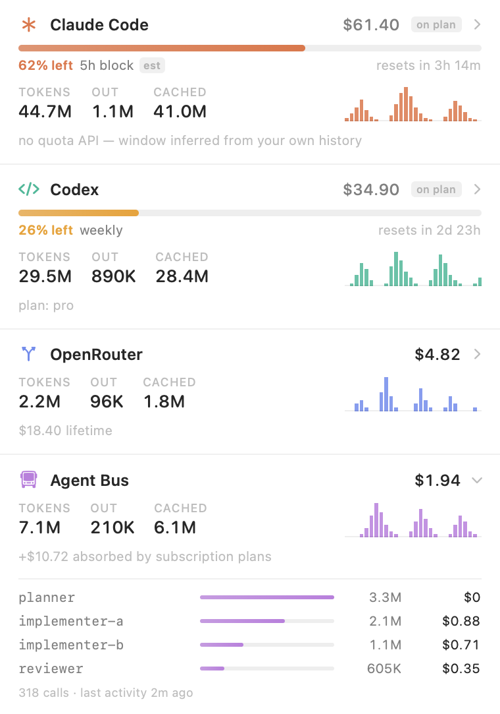

# Doohickey

A menu bar usage tracker for every coding agent on the machine — quota left, tokens
spent, and where they went.

The bar shows one number: how much headroom is left on whichever quota is closest to
running out, across every provider. Click it for the breakdown.



## What it tracks

| Source | Quota | Tokens | Cost |
| --- | --- | --- | --- |
| **Codex** | reported by Codex (`used_percent`, window, reset) | per-turn from rollouts | notional — plan is prepaid |
| **Claude Code** | reconstructed 5-hour block, marked `est` | per-message from transcripts | notional on a Pro/Max plan, billed with an API key |
| **OpenRouter** | credit limit when one is set | from routed transcripts | **real dollars**, from `/api/v1/key` |
| **Agent Bus** | — | from the broker's usage ledger | split metered vs. absorbed by plan |

Nothing is reported that the machine cannot actually observe. Gemini and Cursor keep no
local token record, so they are absent rather than shown as empty cards.

## Metered vs. on plan

The headline number is **money that will appear on a bill**. Usage on a flat-rate plan
is added separately as `+$… on plan`: what the same tokens would have cost metered.

This distinction is the whole reason the totals are believable. Priced naively, a month
of ordinary Codex and Claude Code usage on subscriptions reads as several thousand
dollars — a number that is both true at list rates and completely misleading about what
was spent.

Detection: Codex declares its own `plan_type`; Claude Code is assumed to be on a
subscription unless `ANTHROPIC_API_KEY` or `ANTHROPIC_AUTH_TOKEN` is set. Override per
provider in `~/Library/Application Support/Doohickey/billing.json`:

```json
{ "claudeCode": "metered" }
```

Rates live in `Sources/Core/Pricing.swift` and are overridable the same way, in
`~/Library/Application Support/Doohickey/pricing.json`:

```json
{ "claude-opus": { "input": 15, "output": 75, "cacheRead": 1.5, "cacheWrite": 18.75 } }
```

An unpriced model records its tokens and no cost — a gap is easier to spot than an
invented rate.

## Why it is light

| | Doohickey | CodexBar |
| --- | --- | --- |
| bundle | **780 KB** | 151 MB |
| memory, steady state | **27 MB** | 681 MB |
| memory, after a first full scan | 59 MB | — |
| idle CPU | 0% between refreshes | — |

Measured on the same machine, both idle, `footprint -p`. The higher figure is the peak
left behind by a cold scan of a 14 GB archive; it settles back on the next launch.

One Swift binary against the system frameworks: no Electron, no bundled Node, no
embedded browser. The transcripts it reads are the interesting part — this machine has
14 GB of Codex rollouts and 104 MB of Claude Code sessions, and both directories only
grow. A tracker that re-reads them on every tick is why these apps get heavy.

Instead every file is remembered by inode plus creation time along with how many bytes
have already been folded in. A refresh stats the directory, skips anything whose size
has not changed, and parses only the bytes appended since last time:

```
cold scan (14 GB, first launch)   30 s, in the background
warm refresh                      25 ms
```

Three things make the cold scan bearable, all of them in `Core/JSONLIndex.swift`:

- **Byte prefilter.** Transcripts are overwhelmingly message content; a fraction of a
  percent of lines carry usage. Lines are rejected with `memmem` before
  `JSONSerialization` ever sees them.
- **Block streaming.** Files are read in 4 MB blocks inside an `autoreleasepool`, not
  slurped whole. Skipping the pool cost 2.2 GB resident; adding it brought the same scan
  to 190 MB.
- **Checkpointing.** Progress is persisted every 25 files, so quitting halfway through a
  first scan costs one file rather than the whole run.

Results are kept as hourly buckets per model, so history is bounded by time rather than
transcript volume. The whole 30-day index is ~500 KB on disk.

## Counting rules

Two ways to get these numbers badly wrong, both handled:

- **Claude Code repeats every message.** One record is appended per streaming update,
  all sharing a `message.id`, each restating the full usage block. Summing them inflates
  totals roughly threefold, so `message.id` is the dedupe key.
- **Codex reports cumulative totals too.** `total_token_usage` is restated every turn;
  only `last_token_usage` is the delta. Its `input_tokens` includes the cached portion,
  so cache reads are subtracted out before pricing — otherwise they bill at full input
  rate, which on these volumes is most of the total.

Thinking and reasoning tokens are shown separately but not added again on top of output,
which already contains them.

Traffic routed through a local model router is attributed by model id: a namespaced id
(`stealth/ox-alpha`) was billed by OpenRouter, a bare one by Anthropic. Neither side
double-counts.

## Build

Needs only the Xcode Command Line Tools.

```bash
./doohickey/build.sh && open doohickey/Doohickey.app
```

The app is ad-hoc signed and marked `LSUIElement`, so it lives in the menu bar with no
Dock tile. "Rebuild index from scratch" in the ⋯ menu discards the cache and re-reads
everything.

## Agent Bus integration

The Agent Bus row is the one thing no other tracker can show: **which agent** spent what.
A swarm run appears in the Claude Code and Codex transcripts as one undifferentiated pile
of tokens, with no way to see that a single misconfigured reviewer burned most of it.

It reads the broker's ledger over `POST /usage/summary` on `127.0.0.1:7717`,
authenticating with `~/.agent-bus/operator.token`. When the broker is not running the row
says `broker offline` rather than reading the SQLite file behind its back — the broker
owns that file and may be mid-write.

See `docs/usage-ledger.md` for the broker side.
